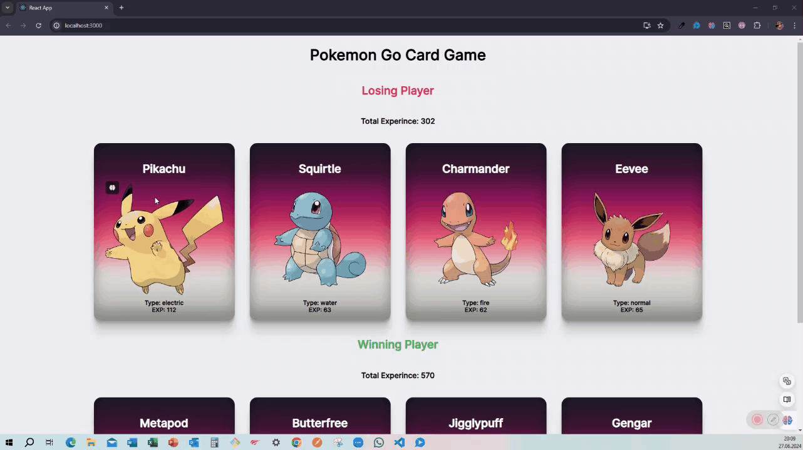

<h1> Pokedex </h1>

proje, JavaScript React, API kullanarak oluşturulmuş bir Pokemon Kart Oyunu uygulamasıdır. Pokemon kartlarının özelliklerini ve detaylarını gösterir, kullanıcıların kartlar ile kaybeden kazanan oyunu oynamasına olanak tanır. 

<h1> Kullanılan Teknolojiler </h1>

- HTML5

- CSS

- JavaScript

- React

  <h1> Ekran Görüntüsü</h1>

